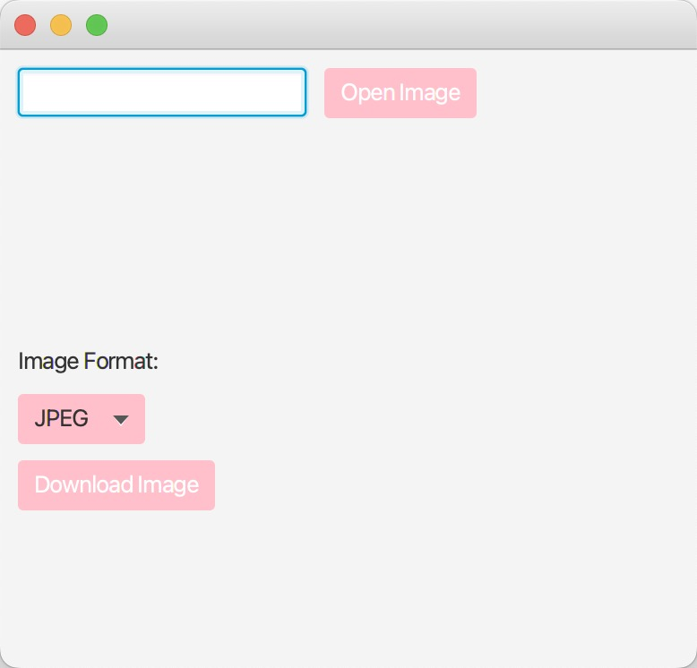

# Final Project

final Basic Components for Final Project:
Use JavaFX for GUI

Include class diagram of your project in the submission

There must be use of inheritance, encapsulation and interfaces

There must be at least one design pattern

Code must be well commented

Include screenshots of various tests done by developer 

Have appropriate exception handling

Add source code to GitHub account and send link with submission

If you want to keep the repository private, add instructor and teaching assistant as a viewers at least until one month after end of semester

Option # 1 (Image Management Tool):
Take one or more image file(s) as input

Develop GUI to allow user to upload image file(s) from desktop/laptop

When uploaded, show image(s) thumbnail(s) (100x100) to users on GUI

Also, show image properties (height, width, camera, location, etc.)

Use Image IO/ImageMagick/JMagick to convert image to various formats

Develop GUI to allow user to select which format(s) to convert the image(s) to

Develop GUI to allow users to download converted images

Optional (no extra credits): Allow user to apply various filters (color tints, black-and-white, etc.) to image(s)

# Image management tools Class Diagram

# test chart
## 1.Default Program Test Graph

## 2.Open Image Test Map

## 3.Open Image Successfully Test Image

## 4.Convert images and download test images
